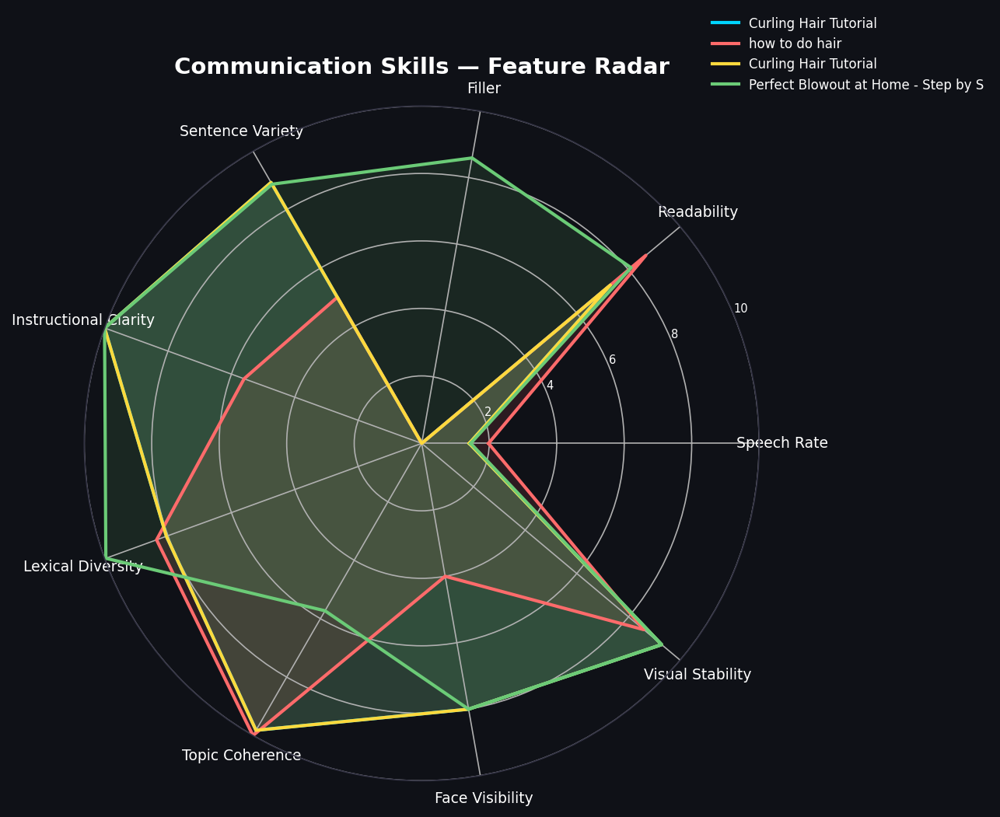
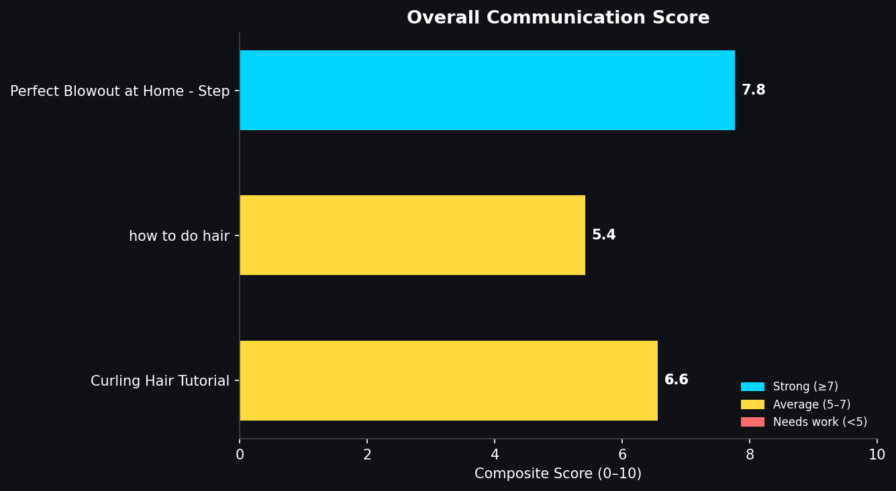

# Communication Skills Feature Extractor
Machine Learning Assignment – Moxie Beauty

```bash
Python | NLP | Computer Vision | Feature Engineering
```

## Problem
The goal of this assignment is to build a system that can estimate the **communication skills of hair styling tutorial creators on YouTube**.  
The system processes tutorial videos and extracts measurable features that can act as proxies for communication effectiveness.

## Approach
Communication quality in tutorial videos depends on both **what the creator says** and **how they present it**.

This solution therefore uses a **multi-modal approach**:

1. **Linguistic Analysis** – analyzes the transcript to measure clarity, pacing, and instructional structure.
2. **Visual Analysis** – analyzes video frames to estimate on-camera presence and visual stability.

The extracted features are normalized to a **0–10 scale** and combined into a final **communication score**.

## Extracted Features

### Linguistic Features
- **Speech Rate (WPM)** – optimal speaking speed improves comprehension
- **Filler Word Ratio** – frequent fillers can reduce clarity
- **Readability Score (Flesch Reading Ease)** – measures how easy the speech is to understand
- **Instructional Word Density** – presence of words like *first, next, step* indicates structured teaching
- **Lexical Diversity (TTR)** – measures vocabulary richness
- **Sentence Length Variation** – natural variation improves engagement
- **Topic Coherence (TF-IDF)** – measures how focused the explanation is

### Visual Features
- **Face Visibility** – percentage of frames where a face is detected
- **Visual Stability** – camera and face movement consistency
- **Lighting Quality** – average frame brightness

These features together approximate communication effectiveness.

## Output
The system produces:
```bash
- `sample_output.csv` – extracted features for each video
- `sample_output.json` – structured output
- `feature_report.xlsx` – formatted report
- `visual charts` - comparing communication scores
```

## Example Visualization





## How to Run

## Install dependencies:
```bash
pip install -r requirements.txt
```

## Run the script:
```bash
python communication_skills_extractor.py
```

## Edit the `VIDEO_URLS` list in the script to analyze different videos.


The results will be saved in the `results/` folder.

